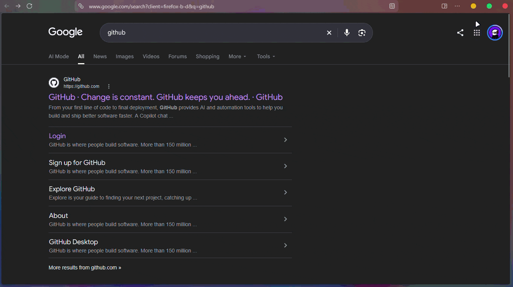
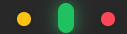

<div align="center">

```text
 ███████╗███████╗███╗   ██╗
 ╚══███╔╝██╔════╝████╗  ██║
   ███╔╝ █████╗  ██╔██╗ ██║
  ███╔╝  ██╔══╝  ██║╚██╗██║
 ███████╗███████╗██║ ╚████║
 ╚══════╝╚══════╝╚═╝  ╚═══╝
https://zen-browser.app/
<br/><!-- ANIMATED GIF PREVIEW --><br/> <br/></div>

✨ Key Features

    🟢 Vertical Pill Morph Controls: macOS-style traffic lights dynamically stretch into smooth vertical pills on hover with spring physics.
    ⚡ HyperOS 4 Motion Physics: Custom elastic bezier curves (cubic-bezier) for buttons, tabs, and popups.
    🏮 Pulsing LED Tab Strip: Selected tabs feature an ambient breathing neon accent line.
    🧊 Frosted Glass Menus: Ultra-blurred translucent glassmorphic popups and dropdowns.
    🚫 Zero Purple Outlines: Completely removes unwanted purple focus borders from URL bars and inputs.
    🔧 Dynamic Window States: Automatically toggles Maximize & Restore buttons cleanly.

📸 Static Preview
<div align="center">  </div>

🛠️ Installation Guide
Step 1: Enable Custom CSS in Zen Browser

    Open Zen Browser, type about:config in the URL bar, and press Enter.

Step 2: Locate Your Profile Folder

    Type about:profiles in the address bar.
    Find the profile that says "This is the profile in use".
    Next to Root Directory, click Open Folder.

Step 3: Add userChrome.css

    Inside your profile folder, open or create a folder named chrome.
    Download or copy userChrome.css from this repository.
    Place userChrome.css inside the chrome folder.
    Restart Zen Browser! 🎉
<div align="center">

Crafted with ❤️ for the Zen Browser Community • Licensed under MIT
</div> ```
    Click "Accept the Risk and Continue".
    Search for: toolkit.legacyUserProfileCustomizations.stylesheets
    Double-click it to set its value to true.
